# SPINGO Pipeline

A comprehensive Shell script pipeline for processing 16S microbiome sequences using [SPINGO](https://github.com/GuyAllard/SPINGO) (SPecies level IdentificatioN of metaGenOmic amplicons).

[](https://www.gnu.org/licenses/gpl-3.0)

## ⬇️ One-Click Download & Installation

> **New to GitHub?** Use the options below for quick setup.

[](https://github.com/Dinesh23244/spingo-pipeline/raw/main/spingo_installed_with_RDP_database.tar.gz)

**One-Click Installation Command:**
```bash
cd ~; wget https://github.com/Dinesh23244/spingo-pipeline/raw/main/spingo_installed_with_RDP_database.tar.gz; tar -xzvf ~/spingo_installed_with_RDP_database.tar.gz; cd ~/SPINGO; ./spingo -h; cd database; make; cd ~
```

> **📌 Copy the command above and paste it into your Linux terminal for automatic download and installation.**

After installation, follow the [SPINGO Scripts Usage Guide](SPINGO_SCRIPTS_USAGE_GUIDE.md) to run your analysis.

## 📋 Overview

This repository provides automated pipeline scripts that streamline the processing of 16S rRNA gene sequencing data from raw FASTQ files to taxonomic classification results. The pipeline handles:

-   ✅ **Single-end reads** (`spingo_single.sh`)
-   ✅ **Paired-end reads** (`spingo_paired.sh`)
-   ✅ **Automatic FASTQ → FASTA conversion**
-   ✅ **Sequential and optional parallel processing**
-   ✅ **Species abundance matrix generation**
-   ✅ **Email notifications on completion**

## 🎯 Features

-   **Fully Automated**: One command processes all samples in a directory
-   **Optimized Performance**: Streaming pipelines with no intermediate files
-   **Optional Parallel Processing**: Process multiple samples simultaneously with GNU Parallel (optional)
-   **Resource Monitoring**: Displays system resources and software versions
-   **Robust Validation**: Checks for SPINGO installation and database availability
-   **Progress Tracking**: Timestamped logging for each processing step
-   **Batch Notifications**: Email alerts when analysis completes

## 📦 Prerequisites

### System Requirements

-   **Operating System**: Linux (Ubuntu, CentOS, etc.)
-   **Memory**: Minimum 8 GB RAM recommended
-   **CPU**: Multi-core processor (4+ cores recommended)
-   **Python**: 2.7 or greater

### Required Software {#required-software}

1.  **SPINGO** - The taxonomic classification tool
2.  **seqtk** - For FASTQ/FASTA manipulation
3.  **Perl** - For species matrix generation

### Optional Software

1.  **GNU Parallel** - For parallel sample processing (scripts default to sequential processing)
2.  **mail** - For email notifications

### Installation of Dependencies

**Required packages:**

**Ubuntu/Debian:**

``` bash
sudo apt-get update
sudo apt-get install seqtk perl
```

**CentOS/RHEL:**

``` bash
sudo yum install epel-release
sudo yum install seqtk perl
```

**Optional packages (for parallel processing and email notifications):**

**Ubuntu/Debian:**

``` bash
sudo apt-get install parallel mailutils
```

**CentOS/RHEL:**

``` bash
sudo yum install parallel mailx
```

## 🚀 SPINGO Installation

This repository includes a **pre-configured SPINGO installation package** (`spingo_installed_with_RDP_database.tar.gz`) that contains:
- ✅ SPINGO executable (pre-compiled)
- ✅ RDP 11.2 reference database (ready to use)
- ✅ All necessary utilities and scripts

> **📌 For complete installation instructions, see [SPINGO_INSTALL_GUIDE.md](SPINGO_INSTALL_GUIDE.md)**

**Alternative:** Install from the [official SPINGO repository](https://github.com/GuyAllard/SPINGO)

## 💻 Getting Started

### Option 1: Use One-Click Installation (Recommended)

Use the one-click installation command at the top of this page for automatic setup.

### Option 2: Clone This Repository

**If the repository contains large files (Git LFS):**

1. **Install Git LFS:**
   ```bash
   # Ubuntu/Debian
   sudo apt-get install git-lfs
   
   # CentOS/RHEL
   sudo yum install git-lfs
   
   # Initialize Git LFS
   git lfs install
   ```

2. **Clone the repository:**
   ```bash
   git clone https://github.com/Dinesh23244/spingo-pipeline.git
   cd spingo-pipeline
   
   # Pull large files
   git lfs pull
   ```

3. **Make scripts executable:**
   ```bash
   chmod +x spingo_single.sh spingo_paired.sh
   ```

4. **Ensure `create_species_matrix.pl` is in your working directory**

> **📌 For detailed usage instructions, see [SPINGO_SCRIPTS_USAGE_GUIDE.md](SPINGO_SCRIPTS_USAGE_GUIDE.md)**

## 📖 Usage

> **💡 Tip:** For large datasets (which may take days or weeks to process), use `nohup` to run the pipeline in the background. This prevents interruption if your SSH connection drops.

**Single-End Reads:**
```bash
cd /path/to/your/fastq/files
nohup bash spingo_single.sh <study_name> <threads> > run_progress.txt &
```

**Paired-End Reads:**
```bash
cd /path/to/your/fastq/files
nohup bash spingo_paired.sh <study_name> <threads> > run_progress.txt &
```

**Monitor progress:**
```bash
tail -f run_progress.txt
```

> **📌 For complete usage instructions, input requirements, and examples, see [SPINGO_SCRIPTS_USAGE_GUIDE.md](SPINGO_SCRIPTS_USAGE_GUIDE.md)**

## 📊 Output Files

### Pipeline Workflow

The pipeline produces outputs in two stages:

**Stage 1: Individual Sample Processing**
- Each sample is processed independently
- SPINGO generates taxonomic classification for each sample
- Output: `<sample_name>_spingo.out.txt` for each input file

**Stage 2: Matrix Generation**
- After ALL samples are processed
- Perl script (`create_species_matrix.pl`) combines all individual results
- Output: `species_matrix_<study_name>.txt` (final abundance matrix)

---

### Individual SPINGO Results

**File:** `<sample_name>_spingo.out.txt` (one per sample)

Tab-separated taxonomic classification results for each sample, containing sequence identifiers, similarity scores, taxonomic assignments (L1, L2, L3), and bootstrap confidence scores.

**Generated during**: Stage 1 (individual sample processing)

### Species Abundance Matrix

**File:** `species_matrix_<study_name>.txt` (one per study)

A combined matrix with taxonomic abundances across all samples, suitable for downstream analysis in R, Python, etc.

**Generated during**: Stage 2 (after all samples processed, using Perl script)

### Intermediate Files

-   `spingo_file_list.txt` - List of all output files processed

## ⚙️ Configuration

The pipeline scripts support:
- **Parallel Processing**: Process multiple samples simultaneously (requires GNU Parallel)
- **Email Notifications**: Get notified when analysis completes
- **SPINGO Parameters**: Customize classification parameters

> **📌 For configuration details, see [SPINGO_SCRIPTS_USAGE_GUIDE.md](SPINGO_SCRIPTS_USAGE_GUIDE.md)**

## 🐛 Troubleshooting

**Common Issues:**
- **SPINGO executable not found**: Verify installation at `~/SPINGO/spingo`
- **Reference database not found**: Run `cd ~/SPINGO/database && make`
- **Missing dependencies**: Install `seqtk` and `perl` (see [Prerequisites](#required-software))
- **create_species_matrix.pl not found**: See [SPINGO_SCRIPTS_USAGE_GUIDE.md](SPINGO_SCRIPTS_USAGE_GUIDE.md) for manual matrix generation

> **📌 For complete troubleshooting guide, see [SPINGO_SCRIPTS_USAGE_GUIDE.md](SPINGO_SCRIPTS_USAGE_GUIDE.md)**

## 📄 License

This pipeline is licensed under the GNU General Public License v3.0 to match SPINGO's license.

See [LICENSE](LICENSE) for details.

## 🙏 Acknowledgments

### Citing This Pipeline

If you use this pipeline in your research, please cite it as:

``` bibtex
@software{spingo_pipeline_2026,
  author = {Dinesh, Palanimuthu},
  title = {SPINGO Pipeline: Automated 16S Microbiome Analysis},
  year = {2026},
  url = {https://github.com/YOUR_USERNAME/spingo-pipeline},
  version = {1.0.0}
}
```

**Or use this text citation:** \> Dinesh Palanimuthu. (2026). SPINGO Pipeline: Automated 16S Microbiome Analysis (Version 1.0.0) [Software]. Available from: <https://github.com/YOUR_USERNAME/spingo-pipeline>

**GitHub Citation:** When you push to GitHub, users can click "Cite this repository" in the sidebar to get the proper citation format automatically!

### SPINGO Citation

If you use this pipeline, please cite the original SPINGO paper:

> Allard G, Ryan FJ, Jeffery IB, Claesson MJ. **SPINGO: a rapid species-classifier for microbial amplicon sequences.** *BMC Bioinformatics.* 2015 Oct 8;16(1):324. doi: [10.1186/s12859-015-0747-1](https://doi.org/10.1186/s12859-015-0747-1). PubMed PMID: 26450747; PubMed Central PMCID: PMC4599320.

### Tools Used

-   **SPINGO**: <https://github.com/GuyAllard/SPINGO>
-   **seqtk**: <https://github.com/lh3/seqtk>
-   **GNU Parallel**: <https://www.gnu.org/software/parallel/>
-   **RDP Database**: <https://rdp.cme.msu.edu/>

### Development

This pipeline was developed by Dinesh Palanimuthu to address practical gaps in the original SPINGO software that were encountered while processing over 10,000 gut microbiome samples. The pipeline streamlines SPINGO usage by providing:

- **Automated workflow**: Eliminates manual steps and reduces user errors
- **Robust error handling**: Validates dependencies and provides clear feedback
- **Batch processing**: Efficiently handles large-scale microbiome studies
- **User-friendly interface**: Simplifies complex operations into single commands

The comprehensive documentation and improvements were developed with AI assistance (Google - Antigravity), combining domain expertise from large-scale microbiome analysis with modern software development practices to create a production-ready pipeline for the research community.

## 📧 Support

For issues with: - **This pipeline**: Open an issue in this repository - **SPINGO itself**: See the [SPINGO GitHub repository](https://github.com/GuyAllard/SPINGO)

## 🔄 Version History

-   **v1.0** (2026): Initial release
    -   Single-end and paired-end support
    -   Parallel processing added but dormant [user himself can activate it by changing "-j 1" to "-j <number of parallel jobs>"]
    -   Automated matrix generation
    -   Email notifications [optional]

------------------------------------------------------------------------

## 🗺️ Complete Workflow Guide

Below is a visual mindmap showing the complete workflow from installation to analysis:

```mermaid
graph TD
    Start([Start: SPINGO Setup]) --> Download[📥 Download SPINGO Package]
    Download --> Install[📦 Install SPINGO]
    
    Install --> InstallMethod{Installation Method}
    InstallMethod -->|Recommended| TarFile[Use spingo_installed_with_RDP_database.tar.gz]
    InstallMethod -->|Alternative| GitHub[Clone from GitHub]
    
    TarFile --> ExtractTar[Extract tar file to home directory]
    GitHub --> CloneRepo[Clone SPINGO repository]
    
    ExtractTar --> VerifyInstall[✅ Verify SPINGO Installation]
    CloneRepo --> BuildDB[Build RDP Database]
    BuildDB --> VerifyInstall
    
    VerifyInstall --> CheckDB{Database Ready?}
    CheckDB -->|No| BuildDB
    CheckDB -->|Yes| InstallDeps[📋 Install Prerequisites]
    
    InstallDeps --> RequiredDeps[Required: seqtk, perl]
    RequiredDeps --> OptionalDeps[Optional: GNU Parallel, mail]
    OptionalDeps --> DataType{Data Type?}
    
    DataType -->|Paired-End| PairedSetup[📂 Prepare Paired-End Data]
    DataType -->|Single-End| SingleSetup[📂 Prepare Single-End Data]
    
    PairedSetup --> PairedNaming[Files: SAMPLE_1.fastq.gz, SAMPLE_2.fastq.gz]
    SingleSetup --> SingleNaming[Files: SAMPLE.fastq.gz]
    
    PairedNaming --> RunPaired[🚀 Run spingo_paired.sh]
    SingleNaming --> RunSingle[🚀 Run spingo_single.sh]
    
    
    RunPaired --> Stage1[⚡ Stage 1: Process Each Sample]
    RunSingle --> Stage1
    
    Stage1 --> SampleSteps[1. Decompress FASTQ<br/>2. Convert to FASTA<br/>3. SPINGO Classification]
    
    SampleSteps --> IndividualFiles[📄 Individual Outputs<br/>sample_spingo.out.txt for each file]
    
    IndividualFiles --> AllProcessed{All Samples<br/>Processed?}
    AllProcessed -->|No| Stage1
    AllProcessed -->|Yes| Stage2[⚡ Stage 2: Generate Matrix]
    
    Stage2 --> PerlScript[Perl Script: create_species_matrix.pl<br/>Combines all *_spingo.out.txt files]
    
    PerlScript --> MatrixFile[📊 Final Output<br/>species_matrix_STUDY.txt]
    
    MatrixFile --> Analysis[📈 Downstream Analysis]
    Analysis --> Complete([✅ Analysis Complete])
    
    style Start fill:#e1f5e1
    style Complete fill:#e1f5e1
    style TarFile fill:#fff4e1
    style MatrixFile fill:#ffe1f0
```



### Quick Reference Path

For users who want a quick overview:

1.  **Install SPINGO** → Use `spingo_installed_with_RDP_database.tar.gz` ([Guide](SPINGO_INSTALL_GUIDE.md))
2.  **Verify Database** → Check `~/SPINGO/database/RDP_11.2.species.fa` exists
3.  **Install Prerequisites** → `seqtk`, `GNU Parallel` (optional), `perl`
4.  **Configure Scripts** → Update paths in `spingo_paired.sh` or `spingo_single.sh` ([Guide](SPINGO_SCRIPTS_USAGE_GUIDE.md))
5.  **Run Analysis** → Choose script based on your data type (paired-end or single-end)
6.  **Get Results** → Individual classifications + species abundance matrix

------------------------------------------------------------------------

**Note:** This pipeline assumes basic familiarity with Unix/Linux command-line operations. For beginners, consider reviewing basic shell commands before starting.
