# SPINGO Pipeline

A comprehensive Shell script pipeline for processing 16S microbiome sequences using [SPINGO](https://github.com/GuyAllard/SPINGO) (SPecies level IdentificatioN of metaGenOmic amplicons).

[](https://www.gnu.org/licenses/gpl-3.0)

## ⬇️ One-Click Download

> **New to GitHub?** Click the button below to download the pre-configured SPINGO package directly — no Git or command-line knowledge required.

[](https://github.com/Dinesh23244/spingo-pipeline/raw/main/spingo_installed_with_RDP_database.tar.gz)

After downloading, follow the [SPINGO Installation Guide](SPINGO_INSTALL_GUIDE.md) to set it up.

## 📋 Overview

This repository provides automated pipeline scripts that streamline the processing of 16S rRNA gene sequencing data from raw FASTQ files to taxonomic classification results. The pipeline handles:

-   ✅ **Single-end reads** (`spingo_single.sh`)
-   ✅ **Paired-end reads** (`spingo_paired.sh`)
-   ✅ **Automatic FASTQ → FASTA conversion**
-   ✅ **Sequential and optional parallel processing**
-   ✅ **Species abundance matrix generation**
-   ✅ **Email notifications on completion**

## 🎯 Features

-   **Fully Automated**: One command processes all samples in a directory
-   **Optimized Performance**: Streaming pipelines with no intermediate files
-   **Optional Parallel Processing**: Process multiple samples simultaneously with GNU Parallel (optional)
-   **Resource Monitoring**: Displays system resources and software versions
-   **Robust Validation**: Checks for SPINGO installation and database availability
-   **Progress Tracking**: Timestamped logging for each processing step
-   **Batch Notifications**: Email alerts when analysis completes

## 📦 Prerequisites

### System Requirements

-   **Operating System**: Linux (Ubuntu, CentOS, etc.)
-   **Memory**: Minimum 8 GB RAM recommended
-   **CPU**: Multi-core processor (4+ cores recommended)
-   **Python**: 2.7 or greater

### Required Software {#required-software}

1.  **SPINGO** - The taxonomic classification tool
2.  **seqtk** - For FASTQ/FASTA manipulation
3.  **Perl** - For species matrix generation

### Optional Software

1.  **GNU Parallel** - For parallel sample processing (scripts default to sequential processing)
2.  **mail** - For email notifications

### Installation of Dependencies

**Required packages:**

**Ubuntu/Debian:**

``` bash
sudo apt-get update
sudo apt-get install seqtk perl
```

**CentOS/RHEL:**

``` bash
sudo yum install epel-release
sudo yum install seqtk perl
```

**Optional packages (for parallel processing and email notifications):**

**Ubuntu/Debian:**

``` bash
sudo apt-get install parallel mailutils
```

**CentOS/RHEL:**

``` bash
sudo yum install parallel mailx
```

## 🚀 SPINGO Installation

This repository includes a **pre-configured SPINGO installation package** (`spingo_installed_with_RDP_database.tar.gz`) that contains: - ✅ SPINGO executable (pre-compiled) - ✅ RDP 11.2 reference database (ready to use) - ✅ All necessary utilities and scripts

### 📥 Quick Installation (Recommended)

**Using the provided tar file:**

> **📌 See detailed step-by-step instructions in [SPINGO_INSTALL_GUIDE.md](SPINGO_INSTALL_GUIDE.md)**
>
> **📥 [Click here to download spingo_installed_with_RDP_database.tar.gz](https://github.com/Dinesh23244/spingo-pipeline/raw/main/spingo_installed_with_RDP_database.tar.gz)**

``` bash
# Navigate to the directory containing the tar file
cd /path/to/directory/containing/tar/file

# Run the complete installation
cp spingo_installed_with_RDP_database.tar.gz ~; tar -xzvf ~/spingo_installed_with_RDP_database.tar.gz; cd ~/SPINGO; ./spingo -h; cd database; make; cd ~
```

**What this does:** 1. Copies the archive to your home directory [check point 1 is to avoid error;Don't remove it] 2. Extracts SPINGO and database files 3. Verifies SPINGO installation 4. Builds the RDP reference database

**Verification:**

``` bash
# Check SPINGO is working
~/SPINGO/spingo -h

# Verify database exists
ls ~/SPINGO/database/RDP_11.2.species.fa
```

### 🔧 Alternative: Install from GitHub

If you prefer to install SPINGO from the official source, visit the **official SPINGO GitHub repository**:

**🔗 <https://github.com/GuyAllard/SPINGO>**

**Quick installation from GitHub:**

``` bash
cd ~
git clone https://github.com/GuyAllard/SPINGO.git
cd SPINGO
./spingo -h  # Verify executable
cd database
make  # Generate database (downloads ~500 MB, takes 10-15 minutes)
```

For detailed installation instructions, compilation from source, and troubleshooting, refer to the official repository's README and documentation.

## 💻 Pipeline Installation

### Step 1: Download This Repository

``` bash
cd ~/
git clone <your-repository-url> spingo-pipeline
cd spingo-pipeline
```

Or download and extract the files manually to any directory.

### Step 2: Make Scripts Executable

``` bash
chmod +x spingo_single.sh spingo_paired.sh
```

### Step 3: Configure SPINGO Paths

The scripts expect SPINGO in `/home/dinesh/SPINGO`. If your installation is different, edit the scripts:

``` bash
# Edit lines 28-29 in both scripts
spingo_directory="/home/YOUR_USERNAME/SPINGO/spingo"
reference_data="/home/YOUR_USERNAME/SPINGO/database/RDP_11.2.species.fa"
```

Or set environment variables (recommended for portability):

``` bash
export SPINGO_HOME="$HOME/SPINGO"
```

### Step 4: Set Up Perl Script

Ensure `create_species_matrix.pl` is in the same directory as your scripts or in your working directory when running the pipeline.

## 📖 Usage

### For Single-End Reads

Place all your `.fastq.gz` files in a directory, then run:

``` bash
cd /path/to/your/fastq/files
/path/to/spingo_single.sh <study_name> <threads>
```

**Example:**

``` bash
cd ~/microbiome_data/gut_samples
~/spingo-pipeline/spingo_single.sh gut_microbiome_2024 8
```

**Parameters:** - `<study_name>`: A name for your analysis (used in output filenames) - `<threads>`: Number of CPU threads to use per sample

### For Paired-End Reads

Files must follow the naming pattern: `SAMPLE_1.fastq.gz` and `SAMPLE_2.fastq.gz`

``` bash
cd /path/to/your/fastq/files
/path/to/spingo_paired.sh <study_name> <threads>
```

**Example:**

``` bash
cd ~/microbiome_data/soil_samples
~/spingo-pipeline/spingo_paired.sh soil_microbiome_2024 8
```

## 📂 Input Requirements

### Single-End Files

```         
sample1.fastq.gz
sample2.fastq.gz
sample3.fastq.gz
```

### Paired-End Files

```         
sample1_1.fastq.gz
sample1_2.fastq.gz
sample2_1.fastq.gz
sample2_2.fastq.gz
```

**Important Notes:** - Files must be gzip-compressed (`.fastq.gz`) - Paired-end files must have `_1` and `_2` suffixes - All files must be in the same directory

## 📊 Output Files

### Pipeline Workflow

The pipeline produces outputs in two stages:

**Stage 1: Individual Sample Processing**
- Each sample is processed independently
- SPINGO generates taxonomic classification for each sample
- Output: `<sample_name>_spingo.out.txt` for each input file

**Stage 2: Matrix Generation**
- After ALL samples are processed
- Perl script (`create_species_matrix.pl`) combines all individual results
- Output: `species_matrix_<study_name>.txt` (final abundance matrix)

---

### Individual SPINGO Results

**File:** `<sample_name>_spingo.out.txt` (one per sample)

Tab-separated taxonomic classification results for each sample, containing sequence identifiers, similarity scores, taxonomic assignments (L1, L2, L3), and bootstrap confidence scores.

**Generated during**: Stage 1 (individual sample processing)

### Species Abundance Matrix

**File:** `species_matrix_<study_name>.txt` (one per study)

A combined matrix with taxonomic abundances across all samples, suitable for downstream analysis in R, Python, etc.

**Generated during**: Stage 2 (after all samples processed, using Perl script)

### Intermediate Files

-   `spingo_file_list.txt` - List of all output files processed

## ⚙️ Advanced Configuration

### Enabling Parallel Processing

By default, scripts process samples **sequentially** (one at a time). To enable parallel processing:

1.  **Install GNU Parallel** (if not already installed):

    ``` bash
    # Ubuntu/Debian
    sudo apt-get install parallel

    # CentOS/RHEL
    sudo yum install parallel
    ```

2.  **Edit the script** (line \~92 in both scripts):

    -   Comment out the sequential loop
    -   Uncomment the parallel processing line

    ``` bash
    # Sequential processing (default - no parallel dependency required)
    #for f in *_1.fastq.gz; do file_name=${f%_1.fastq.gz}; process_sample $file_name; done

    # Parallel processing (optional - uncomment to enable, requires GNU Parallel)
    for f in *_1.fastq.gz; do echo "${f%_1.fastq.gz}"; done | parallel -j 4 process_sample {}
    ```

3.  **Adjust parallel jobs**: Change `-j 1` to `-j N` for N parallel samples

    -   **Recommendation**: Set to `(total_cores / threads_per_sample)` to maximize resource usage

### Email Notifications

To change the notification email, edit line 108 in both scripts:

``` bash
EMAIL="your.email@example.com"
```

To disable emails, comment out the mail command (lines 113-121).

### SPINGO Parameters

The scripts use these SPINGO parameters: - `-w`: Write index file for faster subsequent runs - `-d`: Reference database path - `-p`: Number of threads per sample - `-i`: Input file (streaming from stdin)

To customize (e.g., change k-mer size), edit line 75:

``` bash
"${spingo_directory}" -w -k 10 -d "${reference_data}" -p "${threads}" -i /dev/stdin
```

See [SPINGO documentation](https://github.com/GuyAllard/SPINGO#spingo-parameters) for all available parameters.

## 🐛 Troubleshooting

### "SPINGO executable not found"

-   Verify SPINGO installation: `ls ~/SPINGO/spingo`
-   Check paths in script lines 28-29
-   Ensure SPINGO binary is executable: `chmod +x ~/SPINGO/spingo`

### "Reference database not found"

-   Verify database exists: `ls ~/SPINGO/database/RDP_11.2.species.fa`
-   Re-run database generation: `cd ~/SPINGO/database && make`

### "command not found: seqtk" (or parallel, perl)

-   Install missing dependencies (see [Prerequisites](#required-software))
-   Verify installation: `which seqtk parallel perl`

### "No .fastq.gz files found"

-   Ensure you're in the correct directory: `ls *.fastq.gz`
-   Check file extensions match exactly (`.fastq.gz` not `.fq.gz`)

### "create_species_matrix.pl not found"

-   Copy the Perl script to your working directory
-   Or modify line 100/99 to include full path to the script

### Email not being sent

-   Install mail utility: `sudo apt-get install mailutils`
-   Configure mail settings for your system
-   Or disable email notifications (comment out mail command)

### Out of Memory

-   Reduce parallel jobs: `parallel -j 1`
-   Reduce SPINGO threads parameter
-   Process samples in smaller batches

## 📚 Example Workflow

Complete example from raw data to results:

``` bash
# 1. Ensure SPINGO is installed
ls ~/SPINGO/spingo ~/SPINGO/database/RDP_11.2.species.fa

# 2. Prepare your data
mkdir ~/my_microbiome_study
cd ~/my_microbiome_study
# ... copy your .fastq.gz files here ...

# 3. Verify files
ls -lh *.fastq.gz

# 4. Run the pipeline (single-end example)
~/spingo-pipeline/spingo_single.sh my_study_2024 4

# 5. Monitor progress
# Watch the console output for progress updates

# 6. Check results
ls -lh *_spingo.out.txt
ls -lh species_matrix_my_study_2024.txt

# 7. View sample classification
head sample1_spingo.out.txt
```

## 📄 License

This pipeline is licensed under the GNU General Public License v3.0 to match SPINGO's license.

See [LICENSE](LICENSE) for details.

## 🙏 Acknowledgments

### Citing This Pipeline

If you use this pipeline in your research, please cite it as:

``` bibtex
@software{spingo_pipeline_2024,
  author = {Dinesh, Palanimuthu},
  title = {SPINGO Pipeline: Automated 16S Microbiome Analysis},
  year = {2024},
  url = {https://github.com/YOUR_USERNAME/spingo-pipeline},
  version = {1.0.0}
}
```

**Or use this text citation:** \> Dinesh Palanimuthu. (2024). SPINGO Pipeline: Automated 16S Microbiome Analysis (Version 1.0.0) [Software]. Available from: <https://github.com/YOUR_USERNAME/spingo-pipeline>

**GitHub Citation:** When you push to GitHub, users can click "Cite this repository" in the sidebar to get the proper citation format automatically!

### SPINGO Citation

If you use this pipeline, please cite the original SPINGO paper:

> Allard G, Ryan FJ, Jeffery IB, Claesson MJ. **SPINGO: a rapid species-classifier for microbial amplicon sequences.** *BMC Bioinformatics.* 2015 Oct 8;16(1):324. doi: [10.1186/s12859-015-0747-1](https://doi.org/10.1186/s12859-015-0747-1). PubMed PMID: 26450747; PubMed Central PMCID: PMC4599320.

### Tools Used

-   **SPINGO**: <https://github.com/GuyAllard/SPINGO>
-   **seqtk**: <https://github.com/lh3/seqtk>
-   **GNU Parallel**: <https://www.gnu.org/software/parallel/>
-   **RDP Database**: <https://rdp.cme.msu.edu/>

### Development

This pipeline and its documentation were developed with AI assistance (Google Gemini/Antigravity). The core shell scripts were created by Dinesh Palanimuthu, with improvements, bug fixes, and comprehensive documentation generated through AI collaboration.

## 📧 Support

For issues with: - **This pipeline**: Open an issue in this repository - **SPINGO itself**: See the [SPINGO GitHub repository](https://github.com/GuyAllard/SPINGO)

## 🔄 Version History

-   **v1.0** (2024): Initial release
    -   Single-end and paired-end support
    -   Parallel processing added but dormant [user himself can activate it by changing "-j 1" to "-j <number of parallel jobs>"]
    -   Automated matrix generation
    -   Email notifications [optional]

------------------------------------------------------------------------

## 🗺️ Complete Workflow Guide

Below is a visual mindmap showing the complete workflow from installation to analysis:

``` mermaid
graph TD
    Start([Start: SPINGO Setup]) --> Download[📥 Download SPINGO Package]
    Download --> Install[📦 Install SPINGO]
    
    Install --> InstallMethod{Installation Method}
    InstallMethod -->|Recommended| TarFile[Use spingo_installed_with_RDP_database.tar.gz]
    InstallMethod -->|Alternative| GitHub[Clone from GitHub]
    
    TarFile --> ExtractTar[Extract tar file to home directory]
    GitHub --> CloneRepo[Clone SPINGO repository]
    
    ExtractTar --> VerifyInstall[✅ Verify SPINGO Installation]
    CloneRepo --> BuildDB[Build RDP Database]
    BuildDB --> VerifyInstall
    
    VerifyInstall --> CheckDB{Database Ready?}
    CheckDB -->|No| BuildDB
    CheckDB -->|Yes| InstallDeps[📋 Install Prerequisites]
    
    InstallDeps --> RequiredDeps[Required: seqtk, perl]
    RequiredDeps --> OptionalDeps[Optional: GNU Parallel, mail]
    OptionalDeps --> DataType{Data Type?}
    
    DataType -->|Paired-End| PairedSetup[📂 Prepare Paired-End Data]
    DataType -->|Single-End| SingleSetup[📂 Prepare Single-End Data]
    
    PairedSetup --> PairedNaming[Files: SAMPLE_1.fastq.gz, SAMPLE_2.fastq.gz]
    SingleSetup --> SingleNaming[Files: SAMPLE.fastq.gz]
    
    PairedNaming --> RunPaired[🚀 Run spingo_paired.sh]
    SingleNaming --> RunSingle[🚀 Run spingo_single.sh]
    
    
    RunPaired --> Stage1[⚡ Stage 1: Process Each Sample]
    RunSingle --> Stage1
    
    Stage1 --> SampleSteps[1. Decompress FASTQ<br/>2. Convert to FASTA<br/>3. SPINGO Classification]
    
    SampleSteps --> IndividualFiles[📄 Individual Outputs<br/>sample_spingo.out.txt for each file]
    
    IndividualFiles --> AllProcessed{All Samples<br/>Processed?}
    AllProcessed -->|No| Stage1
    AllProcessed -->|Yes| Stage2[⚡ Stage 2: Generate Matrix]
    
    Stage2 --> PerlScript[Perl Script: create_species_matrix.pl<br/>Combines all *_spingo.out.txt files]
    
    PerlScript --> MatrixFile[📊 Final Output<br/>species_matrix_STUDY.txt]
    
    MatrixFile --> Analysis[📈 Downstream Analysis]
    Analysis --> Complete([✅ Analysis Complete])
    
    style Start fill:#e1f5e1
    style Complete fill:#e1f5e1
    style TarFile fill:#fff4e1
    style Processing fill:#e1f0ff
    style Output fill:#ffe1f0
```



### Quick Reference Path

For users who want a quick overview:

1.  **Install SPINGO** → Use `spingo_installed_with_RDP_database.tar.gz` ([Guide](SPINGO_INSTALL_GUIDE.md))
2.  **Verify Database** → Check `~/SPINGO/database/RDP_11.2.species.fa` exists
3.  **Install Prerequisites** → `seqtk`, `GNU Parallel` (optional), `perl`
4.  **Configure Scripts** → Update paths in `spingo_paired.sh` or `spingo_single.sh` ([Guide](SPINGO_SCRIPTS_USAGE_GUIDE.md))
5.  **Run Analysis** → Choose script based on your data type (paired-end or single-end)
6.  **Get Results** → Individual classifications + species abundance matrix

------------------------------------------------------------------------

**Note:** This pipeline assumes basic familiarity with Unix/Linux command-line operations. For beginners, consider reviewing basic shell commands before starting.
